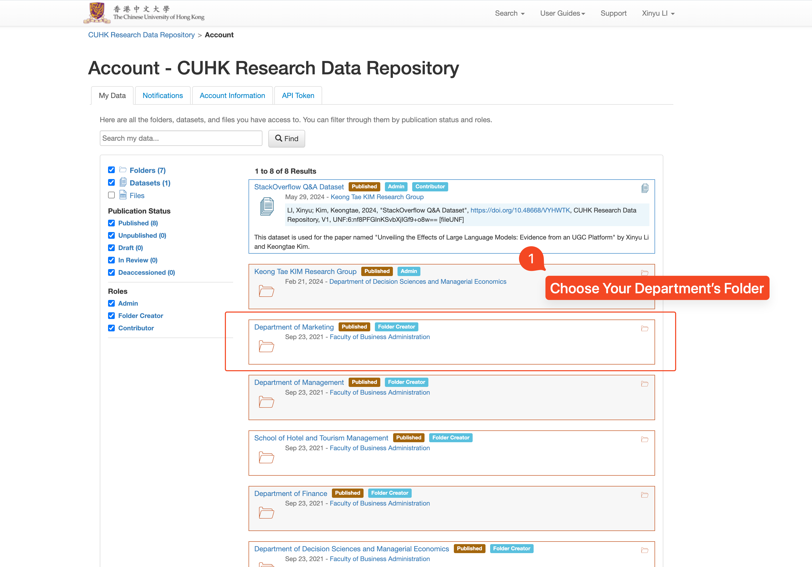

# Guide on Using CUHK Research Repository (for faculty of business administration)

This guide is written for PhD students and faculty members of CUHK Business School to publicly post their research data for internal or external use. Nowadays, the disclosure of research data and code files is commonly mandatory by journals and pubilcations for paper review process. While platforms like Open Science Framework and GitHub are popular choices, CUHK offers its own institutional solution for scholars to collaborate on such research data sharing —— [CUHK Research Data Repository](https://researchdata.cuhk.edu.hk/).

Key uses of the repository include:

- Sharing data and code files for journal submissions
- Collaborating with research teams
- Managing data access for external reviewers
- Creating permanent, citable archives of research materials

## Why depositing data files on public repository becomes important nowadays?

$$
\text{External Academic Transparency and Reproducibility Requirements}, \text{Positive Externality from Data Sharing}
$$

#### Journal Requirements

**Leading journals increasingly mandate data availability as a condition for publication.** For instance, AEA journals require authors to provide all data, programs, and code necessary for replication. Authors must submit detailed documentation including data sources, computational requirements, and complete instructions for replication. INFORMS journals, including Management Science, maintain similarly rigorous standards, requiring authors to provide sufficient documentation for independent verification of results.

#### Grant Requirements

**Many research funding agencies require DMPs to be submitted with new grant applications.** In Hong Kong, RGC does not yet have this requirement. According to our library, DMP is expected to be added as a new part into the GRF application procedures in the coming year. Proactively developing DMPs strengthens grant applications and facilitates systematic data management throughout the research lifecycle.

#### Other Academic Benefits: Enhanced Research Impact

Except for private data obtained from companies, depositing public accessible dataset on public repositories facilitates follow-up research and unexpeted applications, which at the same time, **lead to increased citations.** Additionally, the wide spread of the dataset can naturally bring greater visibility for all the associated publications.

**Beyond individual benefits, shared datasets generate significant positive externalities for the academic community.** This collective approach prevents redundant data collection, enables meta-analyses, and accelerates scientific progress through collaborative efforts. The resulting research ecosystem benefits from more robust findings and innovative methodological advances across disciplines.

## What are the advantages of using this repository?

1. **UNLIMITED, FREE storage to use**

   Currently, there is no public accessible datasets deposit services freely provided for business and management scholars. Even though some economic journal publications like [AEA](https://www.openicpsr.org/openicpsr/aea) has their own data and code repository services, they are only open to authors who have submitted their papers to these specific journals for review. At the same time, non-academic data repositories like GitHub has set limits of the file size (<100 MB, or you need to enable Git LFS for distributing files smaller than 2GB) to ensure the performance and reliability of their services given their commercial considerations.

   This university-owned service, however, is completely FREE for CUHK scholars to formally deposit, maintain and share their (processed) datasets, code files, and other research documents for paper and/or research grant review and later extension of original findings.

2. **Easy for internal collaboration and external sharing**

   Faculty members can easily register an account and create a series of folders for their collarborators and students to upload large-scale datasets and code files. All CUHK IDs can log into the Repository to collaborate on maintaining public and privately shared data repositories. For faculty members who do not wish to "get their hands dirty", you can easily pass the management accesses to anyone in your research teams.

   While for external sharing, a private link can be generated for private peer review for unpublished but uploaded datasets. Later when you decide to post your papers for public view, this research data deposit service allow the generation of DOI for claiming intellectual property and later references from the whole community. The hidden contact information and guestbook options also enable a channel for others to contact you before they are approved to download and use the data files.

3. Seamless incorporation into your workflow for backuping data

   A variety of integrations are oriented toward making it easier for researchers to deposit data. For example, you can deposit datasets from your Dropbox account directly into the CUHK Research Data Repository. Also, the repository supports automatic sync with your GitHub Repository. Also, API services are also provided for customized data deposit schedule and sharing operations.

| Pain Point for Business School Scholars | **CUHK Repository**                                          | Professional Academic Repositories (Harvard Dataverse, ICPSR) | Commercial Platforms (GitHub)                                |
| --------------------------------------- | ------------------------------------------------------------ | ------------------------------------------------------------ | ------------------------------------------------------------ |
| **Proprietary Data Management**         | + Institutional-grade security + Granular access control + Local compliance support - Limited to university affiliation - Less standardized documentation | + Well-established data protection protocols + Standard documentation templates + Recognized by major journals - Fixed privacy options - Less flexible for unique arrangements | + Version control integration + Flexible access management - Size limits for sensitive data - Limited security features - Public visibility bias |
| **Large Dataset Storage**               | + Unlimited storage + No file size limits - Local bandwidth constraints - Variable download speeds | + Large dataset support + Consistent performance - Storage quotas - Dataset size limits - Potential hosting fees | + Git LFS support + Distributed storage - Strict file size limits - Premium costs for large files - Performance issues with big data |
| **Research Team Management**            | + University credential integration + Hierarchical permissions - Complex external access - Limited collaboration tools | + Professional curation support + Standard sharing protocols + Cross-institutional features - Formal processes required - Limited team hierarchy | + Robust collaboration tools + Intuitive team management + Active development community - Public exposure risks - Learning curve for non-tech users |
| **Journal Submission Process**          | + Private review links + Institutional backing - Journal recognition varies - Extra documentation needed | + Journal-standard compliance + DOI integration + Established citation formats - Fixed embargo options - Structured submission rules | + Direct code integration + Version control for analysis - Limited data citation features - Not primary for academic data - Journal acceptance varies |
| **Long-term Program Management**        | + Consistent institutional access + Integrated project management - Career mobility constraints - Platform migration challenges | + Long-term preservation + Academic network effects + Sustainable funding model - Rigid structure - Limited customization | + Flexible project structure + Continuous integration - Platform dependency - Commercial service risks - Limited archival features |

## MUST-KNOWS before you start to use this service...

- This repository is more suitable for depositing **processed datasets and code files**, rather than raw data or manuscripts.
  - A DOI will be provided for official sharing. You can also claim the boundaries of using the data by setting up the licenses for the repository.
  - Uploading Files larger than 3GB requires an extra step of application. [Click Here to Contact the Team]
- Upload data to this repository doesn't mean the dataset is **PUBLIC**.
  - You can deposit **WITHOUT** publishing your dataset in the CUHK Research Data Repository. You can get a private link to share the unpublished dataset with your publisher [for peer review](https://libguides.lib.cuhk.edu.hk/datarepository/peerreview).
  - You can publish your dataset only after your manuscripts are accepted for publications.
- A CUHK ID is needed for edits but not for reviews. For your collaborators who are out of CUHK but wish to edit the files, [applying an independent project account through ITSC](https://www.itsc.cuhk.edu.hk/all-it/accounts-and-access/department-project-account/), or simply asking them to use your CUHK account for temporary use.

## Quick Start Guide

1. Log in CUHK Research Data Repository with 2FA [here](https://researchdata.cuhk.edu.hk/). 

   - When you log in for the first time, you have to create an account by filling the one-time code and checking the box to agree the General Terms of Use.

2. Click "My Data" in the top right corner and Create your research group folder under a department or a research center. The folder is **not** yet published after this step.

   - **Only faculty members or research staffs can create folders.** For PhD students and research assistants, please find your supervisor for help.
   - Identifier* and Category* are two required fields when you create your folder.

   

   

3. Publish your research group folder when your folder is ready for displaying to the public, or **you would like your collaborators or students to collaborate**.

4. Assign a role to your collaborators or students at the designated folder.

   - Search the names of your colleagues or students in the field "**Users/Groups**". 

   - Note: Administrative staff and students must log into the Repository before you can find their names.

   - If you do not prefer to granting them admin access in your research group folder, you can create a subfolder for them with full access.

   - | **Rights on Folder and Datasets** | **Admin** | **Publisher** | **Editor** |
     | :-------------------------------- | --------- | ------------- | ---------- |
     | Permission Management             | Y         |               |            |
     | Publish / Delete                  | Y         | Y             |            |
     | Add / Edit                        | Y         | Y             | Y          |

   

   

5. Create and edit datasets under the folder or subfolder. 

   - Input the required fields including Citation Metadata.
   - Under the “**Files**” tab, upload your files, if they are ready, either by **drag and drop the files** or with "**Select Files to Add**" button.
   - You can upload your data, code and documents from your local computer, [Dropbox folder](https://libguides.lib.cuhk.edu.hk/datarepository/datadeposit#s-lg-box-wrapper-26312071), or [GitHub repositories](https://libguides.lib.cuhk.edu.hk/datarepository/datadeposit#s-lg-box-wrapper-26348175).
   - Each file being uploaded should be less than 30GB. If your file(s) are larger than 30GB, please contact the Research Data Team at [data@cuhk.edu.hk](mailto:data@cuhk.edu.hk).

   

   

   

6. Now you can share your dataset even it is not published by clicking **Private URL** under the button **Edit Dataset**. This will return you a private link for peer review. Or, publish your dataset to the general public.

   - If your publisher requests a DOI of your dataset, it is available in the dataset information box.

   

The above steps shows the foundamental use of CUHK Research Data Repository for datasets deposit and sharing features. For more detailed instructions on data folder & dataset management, please check [this link](https://libguides.lib.cuhk.edu.hk/datarepository/datamanagement) from our library, or contact the data champion of Faculty of Business Administration (Shown in the "Contact" Section of this page).

## Contact

Xinyu Li, Department of Decisions, Operations, and Technology

Email: [xinyu.li@link.cuhk.edu.hk](mailto:xinyu.li@link.cuhk.edu.hk)
